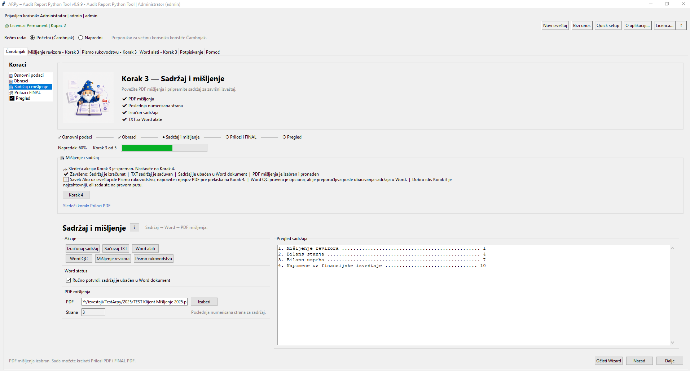
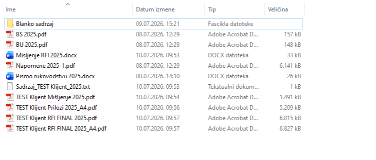

# ARPy Wizard 0.9.9 - kratko uputstvo sa screenshotovima

Tekst je namerno bez srpskih slova sa kvacicama radi pouzdanog prikaza u PDF citacima.

## Pregled procesa
1. Osnovni podaci - klijent, godina, vrsta izvestaja i output folder.
2. Obrasci - dodavanje i provera PDF obrazaca / priloga.
3. Sadrzaj i misljenje - izracun sadrzaja, Word alati i PDF misljenja.
4. Prilozi i FINAL - kreiranje Prilozi PDF i FINAL PDF dokumenta.
5. Zavrsni pregled - provera spremnosti, FINAL QC i output folder.

## Najcesce greske i resenja
- **Sadrzaj je izracunat pre nego sto je poznata strana misljenja.** Uneti poslednju numerisanu stranu ili izabrati PDF misljenja, pa tek onda racunati sadrzaj.
- **PDF misljenja i Prilozi PDF su greskom isti fajl.** Vratiti se na Korak 3 i izabrati pravi PDF misljenja. ARPy 0.9.9 ovo blokira pre kreiranja FINAL PDF-a.
- **Obrasci su promenjeni nakon sto je Prilozi PDF vec napravljen.** Ponovo kreirati Prilozi PDF, zatim ponovo FINAL PDF.
- **Word sadrzaj nije stvarno ubacen, ali je cekirana potvrda.** Otvoriti Word alate, ubaciti sadrzaj u Word, pa tek tada potvrditi status u Wizardu.
- **FINAL QC prikazuje upozorenje.** Procitati upozorenje. Neka upozorenja su informativna, ali rotacije, prazan PDF ili los broj strana treba proveriti pre slanja.
- **Output folder sadrzi stare fajlove od ranijih pokusaja.** Koristiti namenski folder po klijentu/godini ili ocistiti Wizard i ponoviti postupak.

## Screenshotovi
### 1. Korak 1 - Osnovni podaci
Unos subjekta, klijenta, godine, vrste izvestaja i output foldera.

### 2. Korak 2 - PDF obrasci
Dodavanje obrazaca i provera tipa i redosleda priloga.

### 3. Korak 3 - Sadrzaj spreman
Izracun tehnickog sadrzaja i priprema za Word alate.

### 4. Word alati - ubacivanje sadrzaja
Ubacivanje TXT sadrzaja u Word dokument na marker [SADRZAJ].

### 5. Korak 3 - PDF misljenja izabran
Povezivanje PDF misljenja sa Wizard tokom.

### 6. Korak 4 - Prilozi PDF kreiran
Kreiranje Prilozi PDF dokumenta nakon provere obrazaca.

### 7. Korak 4 - FINAL PDF kreiran
Kreiranje finalnog PDF dokumenta i kontrola ocekivanog broja strana.

### 8. Korak 5 - Pregled i zavrsna provera
Zavrsni pregled spremnosti izvestaja, broja strana i output foldera.

### 9. FINAL PDF QC
Zavrsna tehnicka provera finalnog dokumenta.

### 10. Output folder - rezultat
Primer output foldera sa generisanim fajlovima.

