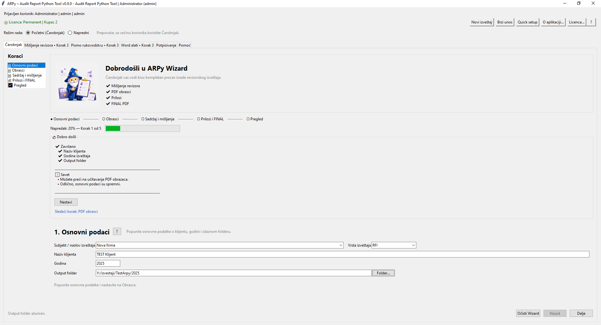
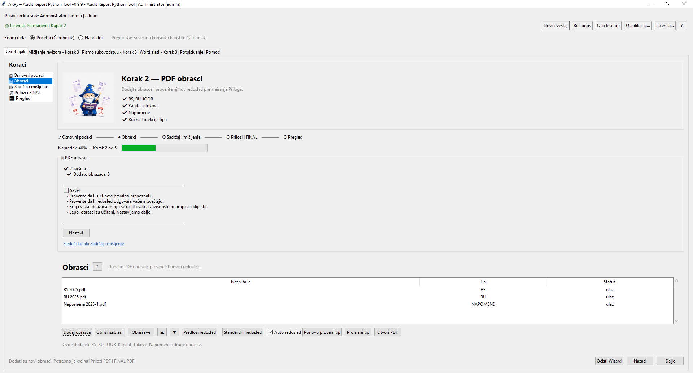
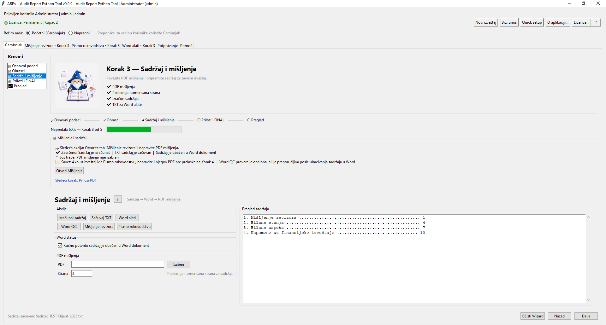
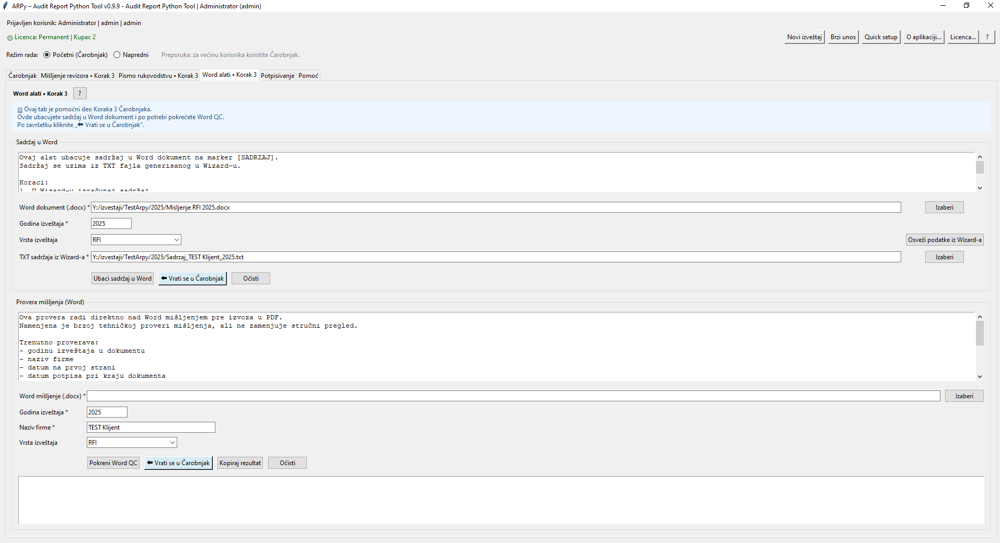
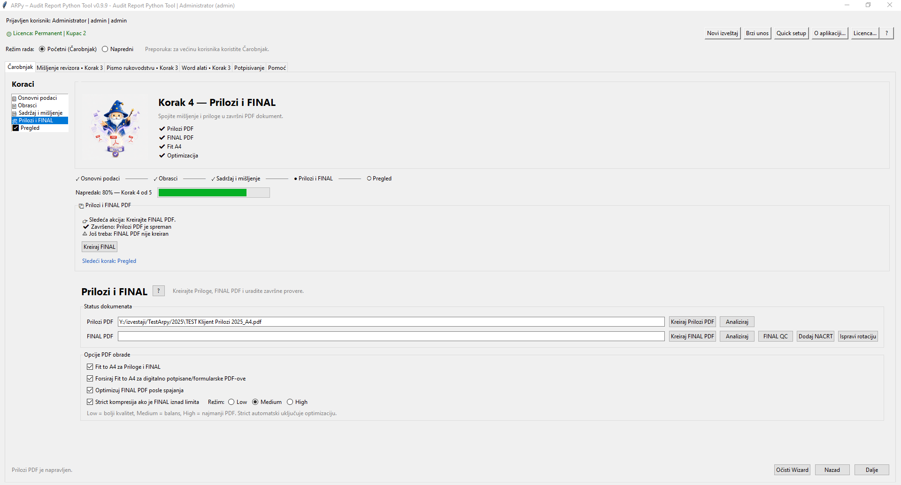
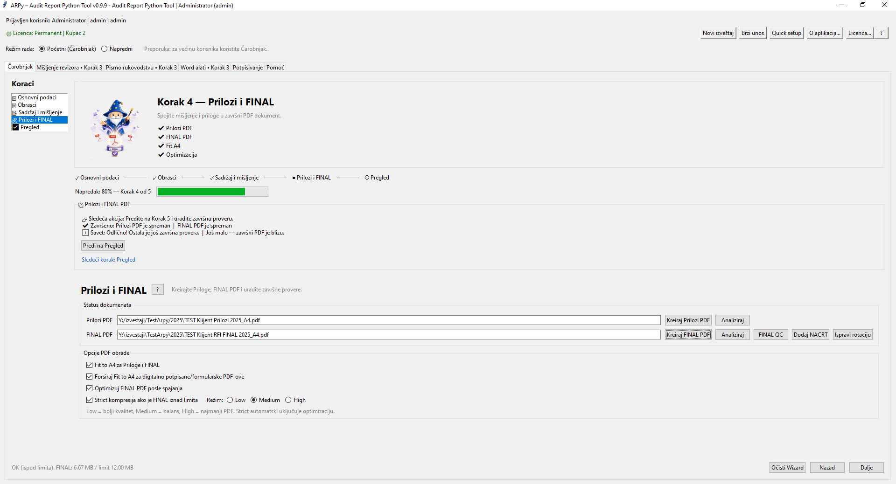
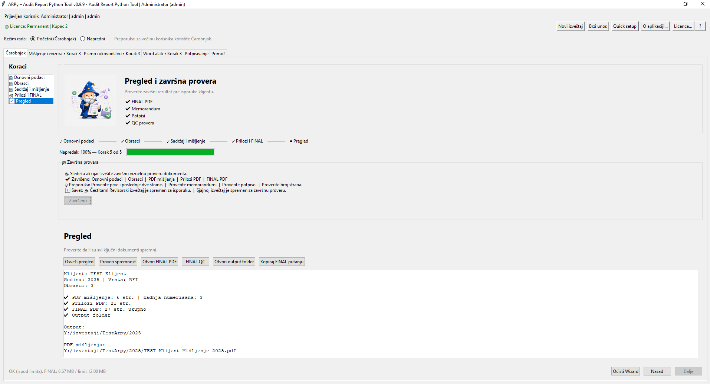
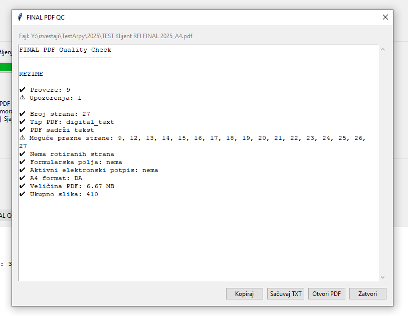

# ARPy Wizard 0.9.9 - kratko uputstvo za izradu FINAL PDF izveštaja

Ovaj vodič je namenjen revizorima i korisnicima koji rade kroz početni režim - Čarobnjak. Cilj je da se jedan izveštaj pripremi kontrolisano: od osnovnih podataka, preko obrazaca i mišljenja, do FINAL PDF-a i završne kontrole kvaliteta.

## Brzi pregled procesa

1. **Osnovni podaci** - klijent, godina, vrsta izveštaja i output folder.
2. **Obrasci** - dodavanje i provera PDF obrazaca / priloga.
3. **Sadržaj i mišljenje** - izračun sadržaja, Word alati i PDF mišljenja.
4. **Prilozi i FINAL** - kreiranje Prilozi PDF i FINAL PDF dokumenta.
5. **Završni pregled** - provera spremnosti, FINAL QC i output folder.

## Pre početka rada

- Pripremiti Word mišljenje ili znati gde se nalazi dokument koji će se izvoziti u PDF.
- Pripremiti PDF obrasce: bilans stanja, bilans uspeha, ostali rezultat, kapital, tokovi gotovine, napomene i druge priloge.
- Raditi na namenskom output folderu za konkretnog klijenta/godinu.
- Ako postoje digitalno potpisani ili formularski PDF dokumenti, ne menjati ih ručno pre obrade u ARPy-ju.

## Korak 1 - Osnovni podaci

Unose se subjekt / naslov izveštaja, naziv klijenta, godina, vrsta izveštaja i output folder.

## Korak 2 - Obrasci

Dodaju se PDF obrasci i prilozi. Proveriti automatski prepoznat tip obrasca i redosled. Ako se dodaje više fajlova odjednom, koristiti Auto redosled.

## Korak 3 - Sadržaj i mišljenje

Uneti poslednju numerisanu stranu mišljenja ili izabrati PDF mišljenja, zatim izračunati sadržaj. Po potrebi sačuvati TXT sadržaj i preći na Word alate.

## Korak 4 - Prilozi i FINAL

Kreirati Prilozi PDF, zatim FINAL PDF. ARPy 0.9.9 proverava da PDF mišljenja i Prilozi PDF nisu isti fajl i kontroliše očekivan broj strana nakon spajanja.

## Korak 5 - Završni pregled

Završni pregled prikazuje status PDF mišljenja, Prilozi PDF-a, FINAL PDF-a i output foldera. Iz ovog koraka mogu se otvoriti FINAL PDF, FINAL QC, output folder i kopirati putanja finalnog fajla.

## FINAL PDF QC

FINAL PDF QC je završna tehnička provera kompletnog dokumenta. Proveravaju se broj strana, A4 format, tekst, prazne strane, formularska polja, elektronski potpisi, veličina PDF-a i osnovna statistika dokumenta.

## Brza kontrolna lista pre isporuke

- [ ] Osnovni podaci su popunjeni.
- [ ] Svi obrasci su dodati i redosled je proveren.
- [ ] Sadržaj je izračunat i ubačen u Word ako je potrebno.
- [ ] PDF mišljenja je izabran i pripada pravom klijentu.
- [ ] Prilozi PDF je kreiran nakon poslednje izmene obrazaca.
- [ ] FINAL PDF je kreiran bez upozorenja o broju strana.
- [ ] Korak 5 prikazuje spreman završni pregled.
- [ ] FINAL PDF QC je pokrenut i rezultat je prihvatljiv.
- [ ] Output folder sadrži očekivane finalne fajlove.
